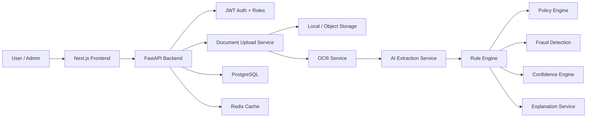
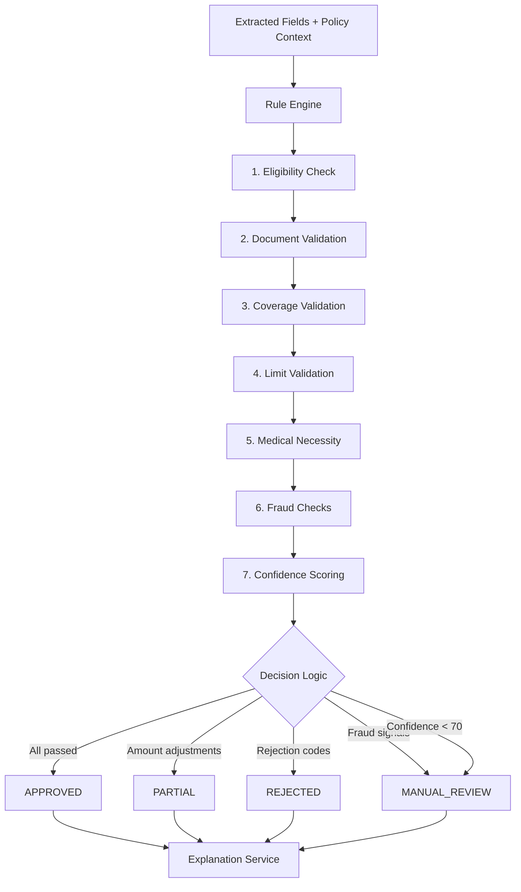
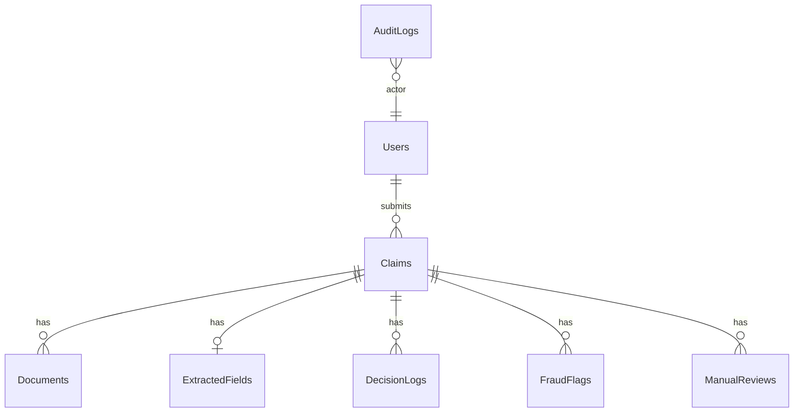

# Architecture

## System Overview

The Plum OPD Claim Adjudication Tool is split into a Next.js frontend and a FastAPI backend. The frontend provides a member claim submission flow and an admin operations dashboard. The backend handles authentication, document processing, AI extraction, deterministic adjudication, and audit logging.

The LLM (GPT-4o) is used strictly for structured data extraction from OCR text. All claim decisions are made by a deterministic rule engine that evaluates JSON policy configuration.

## System Architecture

### Rule Engine Sub-Flow

## Processing Pipeline

The claim processor executes these steps in order:

| Step | Stage | Description |
|------|-------|-------------|
| 1 | Document Upload | Member uploads prescription, medical bill, and optional diagnostic report. File type, size, and corruption are validated. |
| 2 | OCR Processing | Docling extracts text from each document. Falls back to EasyOCR if Docling fails. Produces raw text and a confidence score per document. |
| 3 | Information Extraction | Raw OCR text is sent to GPT-4o with a Pydantic structured output schema. Returns patient name, doctor details, diagnosis, medicines, procedures, tests, amounts, and treatment date. |
| 4 | Policy Loading | The policy engine reads `backend/config/opd_policy.json` to load limits, exclusions, waiting period, network rules, and sub-limits. |
| 5 | Rule Evaluation | The rule engine evaluates six categories in order: Eligibility → Document Validation → Coverage Validation → Limit Validation → Medical Necessity → Fraud Checks. |
| 6 | Fraud Detection | Five checks run against claim history: duplicate claims, same-day frequency, invalid doctor registration, suspicious claim frequency, and unusual amount patterns. |
| 7 | Confidence Scoring | Combines OCR confidence (40%), extraction completeness (40%), document completeness (20%), minus fraud penalties. |
| 8 | Decision | Rejection codes produce `REJECTED`; fraud, low confidence, or missing extracted fields route to `MANUAL_REVIEW`; amount adjustments produce `PARTIAL`; otherwise `APPROVED`. |
| 9 | Audit Logging | Every triggered rule, fraud finding, and decision explanation is persisted. Manual review entries are created for flagged claims. |

## Database Schema

The system uses 8 PostgreSQL tables:

| Table | Purpose | Key Columns |
|-------|---------|-------------|
| `users` | Member and admin accounts | `id`, `email`, `name`, `role`, `hashed_password` |
| `claims` | Claim records with status and amounts | `id`, `user_id`, `status`, `claimed_amount`, `approved_amount`, `confidence_score`, `policy_snapshot` |
| `documents` | Uploaded files with OCR results | `id`, `claim_id`, `document_type`, `filename`, `storage_path`, `ocr_text`, `ocr_confidence` |
| `extracted_fields` | AI-extracted structured data | `id`, `claim_id`, `fields` (JSON), `extraction_confidence` |
| `decision_logs` | Per-rule decision records | `id`, `claim_id`, `decision`, `triggered_rule`, `explanation`, `notes` |
| `fraud_flags` | Detected fraud signals | `id`, `claim_id`, `code`, `severity`, `description` |
| `manual_reviews` | Review queue for flagged claims | `id`, `claim_id`, `reason`, `override_decision`, `override_reason` |
| `audit_logs` | All actor actions for compliance | `id`, `actor_id`, `entity_type`, `entity_id`, `action`, `payload` |

### Entity Relationship

## Key Design Decisions

### JSON Policy Configuration

All policy numbers (limits, exclusions, waiting periods, network providers) are stored in `backend/config/opd_policy.json`. This separates business rules from code. Policy changes do not require code deployment.

### Pydantic Structured Outputs

LLM extraction uses `ExtractedClaimFields`, a Pydantic model with typed fields, validation constraints, and defaults. The LLM cannot return arbitrary data; its output is parsed and validated before reaching the rule engine.

### Deterministic Adjudication

The rule engine evaluates a fixed set of rules in a fixed order. Given the same extracted fields and policy configuration, the engine always produces the same decision. There is no randomness, no LLM involvement, and no probabilistic logic in the decision path.

### Manual Review Threshold

Claims with a composite confidence score below 70 are routed to manual review regardless of whether they pass all policy rules. This catches cases where OCR quality, extraction quality, or document completeness is too low for automated approval.

### Fraud Routes to Review, Not Rejection

Fraud signals never auto-reject a claim. They route the claim to `MANUAL_REVIEW` so a human reviewer can evaluate the flags. This prevents false-positive rejections from automated fraud checks.
